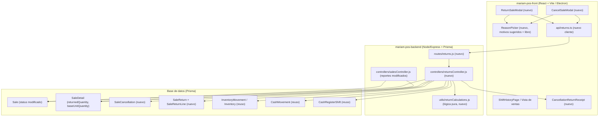
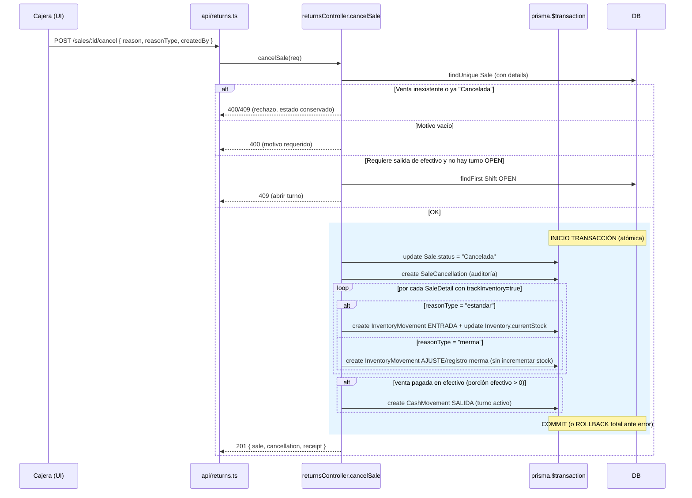
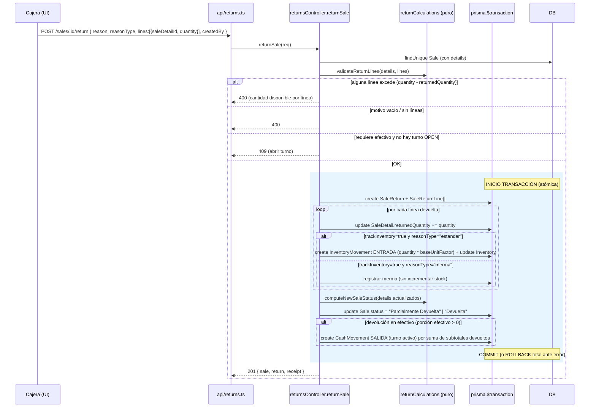

# Documento de Diseño: Cancelaciones y Devoluciones

## Overview

Esta funcionalidad agrega a MariamPOS dos operaciones de reversión controladas sobre ventas ya registradas: la **cancelación** de una venta completa y la **devolución parcial** de uno o más productos. El principio rector del diseño es que **una venta nunca se elimina**: el resultado de cualquier reversión se expresa cambiando el campo `Sale.status` y creando registros de auditoría independientes e inmutables.

El diseño se apoya en los mecanismos que ya existen en el backend (modelo `InventoryMovement` con tipos `ENTRADA`/`SALIDA`/`AJUSTE`, modelo `CashMovement` con tipos `ENTRADA`/`SALIDA`, y `CashRegisterShift` con estados `OPEN`/`CLOSED`/`CANCELLED`). No se crean mecanismos paralelos de inventario ni de efectivo: se reutilizan los existentes para que el corte de caja (`getShiftSummary`, `closeShift`) y los movimientos de inventario sigan cuadrando sin lógica adicional.

Se introducen dos entidades nuevas de bitácora (`SaleCancellation` y `SaleReturn`, esta última con líneas `SaleReturnLine`) y una modificación mínima a `SaleDetail` (campo `returnedQuantity`) para rastrear la cantidad ya devuelta por renglón. Cada operación corre dentro de una **transacción de base de datos** (`prisma.$transaction`), de modo que el cambio de estado de la venta, el registro de auditoría, el movimiento de inventario y el movimiento de efectivo se aplican de forma atómica: todo o nada.

Los reportes de ventas (`getSalesByCategory`, `getSalesByDepartment`, `getTopProducts`, `getSalesSummary`, `getDailySales`) se ajustan para reflejar el **ingreso neto**: excluir por completo las ventas con estado `"Cancelada"` y descontar las cantidades y subtotales devueltos por renglón.

### Decisiones de diseño clave

- **Rastreo de cantidad devuelta — campo `returnedQuantity` en `SaleDetail` (elegido) vs. derivarlo de `SaleReturnLine`.** Se elige persistir `returnedQuantity` como campo denormalizado en `SaleDetail`. **Justificación:** (1) la validación "cantidad a devolver ≤ cantidad vendida − cantidad ya devuelta" se resuelve con una sola lectura del renglón, sin agregar sobre todas las devoluciones históricas; (2) los reportes necesitan `quantity − returnedQuantity` por renglón y hacerlo con un campo directo evita un `GROUP BY` adicional sobre `SaleReturnLine` en cada agregación; (3) la trazabilidad completa (quién/cuándo/cuánto en cada operación) se conserva igual en `SaleReturnLine`, que sigue siendo la fuente de auditoría. El riesgo de denormalización (que `returnedQuantity` difiera de la suma de `SaleReturnLine`) se controla porque **ambos se escriben dentro de la misma transacción**; adicionalmente se define una propiedad de consistencia verificable (ver Correctness Properties) y una consulta de reconciliación.

- **Unidad base y presentaciones.** `SaleDetail` hoy guarda `quantity` en unidades de la presentación vendida (p. ej. 2 "Bultos") y `price` como precio por presentación, pero **no persiste `presentationId` ni el multiplicador de unidad base**. Para cumplir el Requisito 2.8/2.9 sin depender de datos que la venta no guardó, el diseño agrega a `SaleDetail` un campo `baseUnitQuantity` (cantidad en unidad base equivalente al renglón completo) que se calcula al crear la venta. El factor de conversión por renglón es `baseUnitFactor = baseUnitQuantity / quantity`. La devolución mueve inventario por `returnQuantity * baseUnitFactor`. Esto se detalla en Data Models.

- **Clasificación de merma en el backend.** El frontend ofrece los botones de motivo y marca si es merma, pero el backend **revalida** la clasificación para los dos motivos canónicos (`"Producto caducado"`, `"Producto defectuoso / dañado"`) y acepta la marca manual de merma para motivo libre. La decisión merma/estándar se persiste como `reasonType` (`"merma" | "estandar"`) en el registro de auditoría.

- **Turno activo, no turno original.** La salida de efectivo se registra contra el turno `OPEN` de la caja donde se ejecuta la operación hoy, resuelto igual que en `createSales` (buscar `cashRegisterShift` con `status: "OPEN"`). El `shiftId` de auditoría es ese turno activo.

---

## Architecture

### Componentes afectados



### Flujo de Cancelación (con límites de transacción)



### Flujo de Devolución parcial (con límites de transacción)



---

## Components and Interfaces

### Backend — Endpoints

Se agrega un router nuevo `routes/returns.js` y se monta en `index.mjs`. Como las rutas operan sobre una venta, se exponen bajo el recurso `sales`:

| Método | Ruta | Descripción |
|--------|------|-------------|
| `POST` | `/sales/:id/cancel` | Cancela una venta completa |
| `POST` | `/sales/:id/return` | Registra una devolución parcial de líneas |
| `GET`  | `/sales/:id/reversals` | Devuelve la venta con sus `SaleCancellation` y `SaleReturn` (bitácora de esa venta) |
| `GET`  | `/returns` | Lista registros de cancelación/devolución (bitácora, con filtros de fecha/sucursal/caja) |

> Nota de orden de rutas: `routes/sales.js` ya coloca las rutas específicas antes de `/:id`. Las rutas `:id/cancel` y `:id/return` son POST y no colisionan con los GET existentes; pueden vivir en `routes/returns.js` montado en el mismo prefijo `/sales` después del router de ventas, o integrarse en `routes/sales.js`. Se recomienda router separado para aislar la funcionalidad.

#### `POST /sales/:id/cancel`

Request body:
```ts
interface CancelSaleRequest {
  reason: string;              // obligatorio, no vacío (Req 3.1)
  reasonType: "merma" | "estandar"; // clasificación (Req 3.5, 3.7)
  createdBy?: string;          // cajera que ejecuta (auditoría)
  branch?: string;             // si no viene, se toma de la venta
  cashRegister?: string;       // caja donde se ejecuta (para resolver turno activo)
}
```

Response `201`:
```ts
interface CancelSaleResponse {
  sale: Sale;                  // con status = "Cancelada"
  cancellation: SaleCancellation;
  cashMovement: CashMovement | null;      // null si no hubo salida de efectivo
  inventoryMovements: InventoryMovement[]; // solo trackInventory=true + estándar
  receipt: ReversalReceipt;    // comprobante (Req 10.1)
}
```

Errores: `400` motivo vacío; `404` venta inexistente; `409` venta ya "Cancelada" (Req 1.5) o se requiere turno abierto y no existe (Req 7.7).

#### `POST /sales/:id/return`

Request body:
```ts
interface ReturnSaleRequest {
  reason: string;                  // obligatorio (Req 3.2)
  reasonType: "merma" | "estandar";
  createdBy?: string;
  branch?: string;
  cashRegister?: string;
  refundsCash?: boolean;           // si se devuelve dinero físico (Req 7.4)
  lines: Array<{
    saleDetailId: number;          // renglón de la venta
    quantity: number;              // cantidad a devolver (en unidad de venta del renglón)
  }>;
}
```

Response `201`:
```ts
interface ReturnSaleResponse {
  sale: Sale;                      // status "Parcialmente Devuelta" | "Devuelta"
  return: SaleReturn;              // con lines
  cashMovement: CashMovement | null;
  inventoryMovements: InventoryMovement[];
  receipt: ReversalReceipt;        // comprobante (Req 10.2)
}
```

Errores: `400` motivo vacío, sin líneas, o cantidad > disponible (Req 2.3, con `availableByLine`); `404` venta/renglón inexistente; `409` requiere turno abierto y no existe (Req 2.10, 7.7).

#### Forma del comprobante (Req 10)

```ts
interface ReversalReceipt {
  type: "CANCELACION" | "DEVOLUCION"; // Req 10.3: identifica claramente la operación
  originalFolio: string | null;
  dateTime: string;        // ISO
  cashier: string | null;
  branch: string | null;
  cashRegister: string | null;
  reason: string;
  reasonType: "merma" | "estandar";
  refundedAmount: number;  // monto devuelto en efectivo (0 si no hubo)
  lines?: Array<{ productName: string; quantity: number; subTotal: number }>; // solo devolución
}
```

### Backend — Controllers y lógica pura

**`controllers/returnsController.js`** (nuevo): `cancelSale`, `returnSale`, `getSaleReversals`, `listReversals`. Orquestan validaciones, resolución de turno activo y la transacción Prisma.

**`utils/returnCalculations.js`** (nuevo, **funciones puras sin acceso a BD** — base de las pruebas PBT):

```js
// Cantidad disponible para devolver en un renglón.
export function availableToReturn(detail) {
  return detail.quantity - (detail.returnedQuantity ?? 0);
}

// Valida un conjunto de líneas de devolución contra los renglones de la venta.
// Devuelve { ok, errors:[{ saleDetailId, requested, available }] }.
export function validateReturnLines(details, lines) { /* ... */ }

// Factor de conversión a unidad base de un renglón.
// baseUnitFactor = baseUnitQuantity / quantity (1 si no hay presentación).
export function baseUnitFactor(detail) {
  if (!detail.quantity) return 1;
  return (detail.baseUnitQuantity ?? detail.quantity) / detail.quantity;
}

// Cantidad en unidad base a mover en inventario por una línea devuelta.
export function inventoryDeltaForLine(detail, returnQuantity) {
  return returnQuantity * baseUnitFactor(detail);
}

// Nuevo estado de la venta tras aplicar devoluciones.
// "Devuelta" si todos los renglones quedaron completamente devueltos;
// "Parcialmente Devuelta" si al menos uno tiene pendiente > 0.
export function computeNewSaleStatus(details) { /* ... */ }

// Monto en efectivo a devolver.
// Para cancelación: porción efectivo del total (maneja pago mixto).
// Para devolución: suma de subtotales de líneas devueltas (porción efectivo).
export function cashRefundAmount({ paymentMethod, amount }) { /* ... */ }

// Extrae la porción pagada en efectivo desde paymentMethod (incluye "Mixto (Efectivo: $X, Tarjeta: $Y)").
export function cashPortionFromPaymentMethod(paymentMethod, total) { /* ... */ }
```

> La extracción de la porción en efectivo de un pago mixto reutiliza el mismo formato de string que ya parsean `closeShift`/`getShiftSummary` en `cashRegisterController.js` (`"Mixto (Efectivo: $X, Tarjeta: $Y)"`), para mantener consistencia con el corte de caja.

### Frontend — Componentes (en `src/pages/sales/`)

- **`CancelSaleModal.tsx`** (nuevo): confirma la cancelación de una venta; embebe `ReasonPicker`; llama `cancelSale` del cliente API; al éxito abre el comprobante.
- **`ReturnSaleModal.tsx`** (nuevo): lista los renglones de la venta con la cantidad disponible (`quantity - returnedQuantity`), permite elegir cantidades por renglón; embebe `ReasonPicker`; valida en cliente antes de enviar; llama `returnSale`.
- **`ReasonPicker.tsx`** (nuevo): botones de un clic con `Motivos_Sugeridos` (listas distintas para cancelación y devolución, Req 3.3/3.4) + campo de texto libre ("Otro motivo", Req 3.6) + checkbox "Es merma" habilitado para motivo libre (Req 3.7). Marca automáticamente `reasonType="merma"` para "Producto caducado" y "Producto defectuoso / dañado".
- **`CancellationReturnReceipt.tsx`** (nuevo): renderiza el comprobante (reutiliza el patrón de `Ticket.tsx`), rotulado claramente como CANCELACIÓN o DEVOLUCIÓN.
- Punto de entrada: desde la vista de historial/listado de ventas (p. ej. `ShiftHistoryPage.tsx` / vista de ventas del turno) se agregan acciones "Cancelar" y "Devolver" por venta.

Los `Motivos_Sugeridos` se definen como constantes en frontend (p. ej. `src/constants/index.ts`), por ser una preocupación de presentación:

```ts
export const CANCEL_REASONS = [
  "Error de captura", "Producto equivocado", "Cliente se arrepintió",
  "Cobro duplicado", "Precio incorrecto", "Prueba / capacitación",
] as const;

export const RETURN_REASONS = [
  "Producto caducado", "Producto defectuoso / dañado", "Producto equivocado",
  "Cliente insatisfecho", "No era lo que esperaba",
] as const;

export const MERMA_REASONS = ["Producto caducado", "Producto defectuoso / dañado"] as const;
```

### Frontend — Cliente API (`src/api/returns.ts`, nuevo)

Sigue el patrón de `src/api/sales.ts` (usa `getAxiosClient`):

```ts
export const cancelSale = async (saleId: number, body: CancelSaleRequest): Promise<CancelSaleResponse> => {
  const clientAxios = await getAxiosClient();
  const { data } = await clientAxios.post<CancelSaleResponse>(`/sales/${saleId}/cancel`, body);
  return data;
};

export const returnSale = async (saleId: number, body: ReturnSaleRequest): Promise<ReturnSaleResponse> => {
  const clientAxios = await getAxiosClient();
  const { data } = await clientAxios.post<ReturnSaleResponse>(`/sales/${saleId}/return`, body);
  return data;
};

export const getSaleReversals = async (saleId: number) => {
  const clientAxios = await getAxiosClient();
  const { data } = await clientAxios.get(`/sales/${saleId}/reversals`);
  return data;
};
```

---

## Data Models

### Modificaciones a modelos existentes

#### `Sale` — nuevos valores de `status`

El campo `status` (`String?`) hoy usa `"Pendiente"` / `"Pagado"`. Se amplía el conjunto de valores admitidos (no requiere migración de columna, solo convención de dominio):

- `"Pendiente"`, `"Pagado"` (existentes)
- `"Cancelada"` (nuevo)
- `"Parcialmente Devuelta"` (nuevo)
- `"Devuelta"` (nuevo)

Relaciones inversas nuevas:
```prisma
model Sale {
  // ...campos existentes...
  cancellation SaleCancellation?   // 1:1 (una venta se cancela a lo sumo una vez)
  returns      SaleReturn[]        // 1:N (varias devoluciones parciales en el tiempo)
}
```

#### `SaleDetail` — rastreo de cantidad devuelta y unidad base

```prisma
model SaleDetail {
  // ...campos existentes: quantity, price, subTotal, productName, unitAbbrev...

  // Cantidad ya devuelta de este renglón, en la MISMA unidad que `quantity`
  // (unidad de venta/presentación). Se incrementa en cada devolución.
  returnedQuantity Float @default(0)

  // Cantidad del renglón expresada en UNIDAD BASE del producto.
  // Para producto simple: igual a `quantity`.
  // Para presentación: quantity * (unidades que contiene la presentación).
  // Permite mover inventario en unidad base (Req 2.8/2.9) sin depender de
  // datos de presentación que la venta no persistía antes.
  baseUnitQuantity Float?

  returnLines SaleReturnLine[]   // auditoría de devoluciones de este renglón
}
```

> **Nota de implementación / backfill:** `baseUnitQuantity` es opcional para no romper ventas históricas. Al crear la venta (`createSales`) debe poblarse: cuando el renglón proviene de una presentación, `baseUnitQuantity = quantity * presentation.quantity`; en otro caso `baseUnitQuantity = quantity`. Para ventas antiguas sin este dato, `baseUnitFactor` cae a `1` (devuelve en unidad de venta), lo que es seguro para productos simples. Esto implica un pequeño cambio en `createSales` para calcular y guardar `baseUnitQuantity` (y requiere que el frontend envíe el multiplicador de la presentación en el detalle).

### Modelos nuevos

#### `SaleCancellation` (bitácora de cancelación)

```prisma
model SaleCancellation {
  id Int @id @default(autoincrement())

  // Venta original (1:1). No se elimina nunca.
  saleId Int  @unique
  sale   Sale @relation(fields: [saleId], references: [id])

  // Motivo y clasificación
  reason     String                 // texto del motivo (obligatorio)
  reasonType SaleReversalReasonType  @default(ESTANDAR) // ESTANDAR | MERMA

  // Auditoría
  createdBy    String?  // cajera que ejecutó
  branch       String?  // sucursal
  cashRegister String?  // caja donde se ejecutó

  // Turno ACTIVO donde se ejecutó (no el de la venta original)
  shiftId Int?
  shift   CashRegisterShift? @relation(fields: [shiftId], references: [id])

  // Efecto monetario (referencia al movimiento generado, si hubo)
  cashMovementId Int?    // null si no hubo salida de efectivo
  refundedAmount Float   @default(0)

  createdAt DateTime @default(now())

  @@index([saleId])
  @@index([shiftId])
  @@index([createdAt])
}
```

#### `SaleReturn` + `SaleReturnLine` (bitácora de devolución)

```prisma
model SaleReturn {
  id Int @id @default(autoincrement())

  // Venta original (1:N: puede haber varias devoluciones parciales)
  saleId Int
  sale   Sale @relation(fields: [saleId], references: [id])

  reason     String
  reasonType SaleReversalReasonType @default(ESTANDAR)

  createdBy    String?
  branch       String?
  cashRegister String?

  // Turno ACTIVO donde se ejecutó la devolución
  shiftId Int?
  shift   CashRegisterShift? @relation(fields: [shiftId], references: [id])

  cashMovementId Int?
  refundedAmount Float   @default(0) // suma de subtotales devueltos en efectivo

  lines SaleReturnLine[]

  createdAt DateTime @default(now())

  @@index([saleId])
  @@index([shiftId])
  @@index([createdAt])
}

model SaleReturnLine {
  id Int @id @default(autoincrement())

  saleReturnId Int
  saleReturn   SaleReturn @relation(fields: [saleReturnId], references: [id], onDelete: Cascade)

  // Renglón original devuelto
  saleDetailId Int
  saleDetail   SaleDetail @relation(fields: [saleDetailId], references: [id])

  // Cantidad devuelta en esta operación, en unidad de venta del renglón
  quantity Float

  // Cantidad equivalente en unidad base (para auditoría del movimiento de inventario)
  baseUnitQuantity Float

  // Subtotal devuelto de esta línea (quantity * price del renglón)
  subTotal Float

  createdAt DateTime @default(now())

  @@index([saleReturnId])
  @@index([saleDetailId])
}
```

#### Enum nuevo

```prisma
enum SaleReversalReasonType {
  ESTANDAR // el producto regresa a existencias (si trackInventory=true)
  MERMA    // caducidad/defecto: no regresa a existencias
}
```

### Relaciones inversas a agregar en modelos existentes

```prisma
model CashRegisterShift {
  // ...
  saleCancellations SaleCancellation[]
  saleReturns       SaleReturn[]
}
```

### Reuso de inventario y efectivo (sin modelos nuevos)

- **Inventario:** se usa `InventoryMovement` existente. Para devolución/cancelación estándar con `trackInventory=true`: `type: "ENTRADA"`, `quantity` = cantidad en unidad base (redondeada a entero, pues `InventoryMovement.quantity` es `Int`), `reason` = motivo, `reference` = referencia al registro (`"CANCEL#<id>"` / `"RETURN#<id>"`), `branch`, `cashRegister`, `createdBy`. Se actualiza `Inventory.currentStock` igual que en `createInventoryMovement`. Para merma: se registra el movimiento con un `reason`/`notes` que lo identifique como merma **sin incrementar** `currentStock` (opción: `type: "AJUSTE"` dejando el stock igual, o `type: "SALIDA"` con nota de merma; se documenta la elección en la fase de tasks). trackInventory=false → no se crea ningún movimiento.
- **Efectivo:** se usa `CashMovement` existente con `type: "SALIDA"`, `amount` = monto en efectivo devuelto, `shiftId` = turno activo, `reason` = motivo, `createdBy`. Se enlaza su `id` en `cashMovementId` del registro de auditoría.

---

## Report changes

Todas las agregaciones de reporte en `salesController.js` deben cambiar según dos reglas: **(A)** excluir ventas `"Cancelada"`; **(B)** descontar lo devuelto por renglón usando `quantity - returnedQuantity` y el subtotal proporcional.

Para el subtotal neto por renglón se usa:
`netSubTotal = subTotal * ((quantity - returnedQuantity) / quantity)` (si `quantity > 0`; si `quantity = 0`, `netSubTotal = 0`). Esto reparte el subtotal del renglón proporcionalmente a la cantidad no devuelta, sin depender de que `price` siga vigente.

| Función | Cambio exacto requerido |
|---------|--------------------------|
| `getSalesByCategory` | En el `findMany`, agregar al `where`: `status: { not: "Cancelada" }`. Al acumular por categoría, usar cantidad neta `detail.quantity - detail.returnedQuantity` en vez de `detail.quantity`, y `netSubTotal` en vez de `detail.subTotal`. |
| `getSalesByDepartment` | Igual que anterior: `where.status = { not: "Cancelada" }`; acumular `current.total += netSubTotal`, `current.quantity += (detail.quantity - detail.returnedQuantity)`; recalcular `granTotal` con `netSubTotal`. |
| `getTopProducts` | El `findMany` es sobre `saleDetail`. Agregar filtro de la venta: `where.sale = { status: { not: "Cancelada" }, ...(cashRegister ? { cashRegister } : {}) }`. Seleccionar también `quantity` y `returnedQuantity`; agrupar sumando `quantity - returnedQuantity`. |
| `getSalesSummary` | Agregar `where.status = { not: "Cancelada" }`. **Problema:** hoy suma `Sale.total`, que es el total original y no refleja devoluciones parciales. Debe calcularse el ingreso neto. Opción recomendada: sumar `netSubTotal` sobre los detalles de las ventas no canceladas (requiere incluir `details`), en lugar de `sale.total`. `totalVentas` (conteo) debe contar solo ventas no canceladas. |
| `getDailySales` | Hoy usa `$queryRaw` sobre `Sale` sumando `total`. Agregar al WHERE `AND "status" <> 'Cancelada'` (o `status IS NULL OR status <> 'Cancelada'` para no excluir nulos). Para reflejar devoluciones parciales, la suma por día debe calcularse sobre el neto de los detalles; esto implica cambiar la consulta raw a un JOIN con `SaleDetail` sumando `subTotal * (quantity - returnedQuantity)/quantity`, o reemplazar la consulta raw por un `findMany` con `details` y agrupar en JS por fecha. Se documenta la variante elegida en tasks. |
| `getSalesByPaymentMethod` | Agregar `where.status = { not: "Cancelada" }`. (Las devoluciones parciales no cambian el método de pago; el ajuste de monto neto es opcional y se evalúa en tasks, pero la exclusión de canceladas es obligatoria por consistencia.) |
| `getSalesByClient` | No lo exige explícitamente el Requisito 8, pero por coherencia del ingreso neto se recomienda agregar `where.status = { not: "Cancelada" }`. |

> Observación importante: el filtro `status: { not: "Cancelada" }` en Prisma/SQLite excluye filas con ese valor exacto; las ventas con `status = null` o `"Pagado"` se conservan. Para `$queryRaw` usar `(status IS NULL OR status <> 'Cancelada')`.

---

## Correctness Properties

Propiedades formales, adecuadas para pruebas basadas en propiedades (PBT). Variables universalmente cuantificadas sobre entradas válidas generadas.

1. **La cantidad devuelta nunca excede lo vendido disponible.**
   ∀ renglón `d`, ∀ secuencia de devoluciones aceptadas: `0 ≤ Σ(quantity_devuelta) ≤ d.quantity`. Equivalente: cada operación válida cumple `returnQuantity ≤ availableToReturn(d)` y, tras aplicarla, `d.returnedQuantity ≤ d.quantity`.

2. **Suma de devoluciones + remanente = original.**
   ∀ renglón `d`: `d.returnedQuantity + (d.quantity - d.returnedQuantity) = d.quantity`. Tras cualquier número de devoluciones, `Σ SaleReturnLine.quantity (de d) = d.returnedQuantity`.

3. **Consistencia denormalizada.**
   ∀ renglón `d`: `d.returnedQuantity == Σ { l.quantity | l ∈ SaleReturnLine, l.saleDetailId = d.id }`. (Invariante que une el campo denormalizado con la fuente de auditoría; verificable por reconciliación.)

4. **Estado derivado correcto.**
   `computeNewSaleStatus(details)` = `"Devuelta"` ⟺ ∀ d: `d.returnedQuantity == d.quantity`; = `"Parcialmente Devuelta"` ⟺ (∃ d: `d.returnedQuantity > 0`) ∧ (∃ d: `d.returnedQuantity < d.quantity`).

5. **Una venta cancelada aporta cero a los reportes.**
   ∀ venta con `status = "Cancelada"`: su contribución a `getSalesByCategory`, `getSalesByDepartment`, `getTopProducts`, `getSalesSummary`, `getDailySales` es exactamente 0 (en monto y cantidad).

6. **Monto neto de reporte = original − devuelto.**
   ∀ venta no cancelada: `Σ netSubTotal(d) = Σ (d.subTotal * (d.quantity - d.returnedQuantity)/d.quantity)`, y este valor decrece monótonamente al aumentar `returnedQuantity`, nunca por debajo de 0.

7. **La salida de efectivo iguala la porción pagada en efectivo.**
   Cancelación: `cashMovement.amount = cashPortionFromPaymentMethod(paymentMethod, total)`; si no hay porción efectivo, no se crea `CashMovement`. Devolución: `cashMovement.amount = Σ subTotal(líneas devueltas)` cuando `refundsCash` y la venta fue en efectivo; `0`/sin movimiento en otro caso. Nunca `amount < 0`.

8. **Inventario solo se mueve para `trackInventory = true`.**
   ∀ producto con `trackInventory = false`: número de `InventoryMovement` creados por la operación = 0. ∀ producto con `trackInventory = true` y `reasonType = ESTANDAR`: se crea exactamente un `InventoryMovement ENTRADA` por línea y `currentStock` aumenta en `inventoryDeltaForLine(d, q)`. Con `reasonType = MERMA`: `currentStock` no cambia.

9. **Conversión a unidad base.**
   ∀ renglón con presentación: `inventoryDeltaForLine(d, q) = q * (d.baseUnitQuantity / d.quantity)`. Para producto simple (`baseUnitQuantity = quantity`): `inventoryDeltaForLine(d, q) = q`. (Ej.: 1 Bulto de 20 kg ⇒ delta 20.)

10. **Atomicidad (invariante transaccional).**
    Tras ejecutar una operación: o bien **todos** los efectos existen (status actualizado ∧ registro de auditoría ∧ movimientos de inventario correspondientes ∧ movimiento de efectivo si aplica), o bien **ninguno** existe (ante cualquier error, rollback total; el estado de la venta y los stocks quedan como antes). No existe estado intermedio observable.

11. **No eliminación / inmutabilidad.**
    Para toda operación, el `count` de `Sale` y de `SaleDetail` no disminuye, y `sale.total` y los `subTotal` originales de los renglones permanecen sin cambios (solo cambian `status` y `returnedQuantity`).

---

## Error Handling

| Escenario | Condición | Respuesta | Recuperación |
|-----------|-----------|-----------|--------------|
| Motivo vacío | `reason` nulo/espacios | `400 { error: "El motivo es obligatorio" }` | La UI exige seleccionar/escribir motivo antes de habilitar el botón. |
| Venta inexistente | `findUnique` → null | `404 { error: "Venta no encontrada" }` | — |
| Venta ya cancelada | `sale.status === "Cancelada"` | `409 { error: "La venta ya está cancelada" }` (Req 1.5) | La UI deshabilita "Cancelar" para ventas ya canceladas. |
| Cantidad excede disponible | `quantity > availableToReturn(d)` | `400 { error, availableByLine: [{ saleDetailId, available }] }` (Req 2.3) | La UI muestra la cantidad disponible y limita el input por renglón. |
| Sin líneas en devolución | `lines` vacío | `400 { error: "Debe indicar al menos una línea a devolver" }` | — |
| Requiere efectivo y no hay turno OPEN | salida de efectivo ∧ no existe `Shift` `OPEN` en la caja | `409 { error: "Se requiere un turno de caja abierto", requiresShift: true }` (Req 2.10, 7.7) | La UI ofrece abrir turno (`ShiftModal`) y reintentar. |
| Error dentro de la transacción | cualquier excepción Prisma | `500`; **rollback total** por `$transaction` | Nada se persiste; la cajera puede reintentar sin estado inconsistente. |
| Inventario inexistente para producto `trackInventory=true` | `Inventory` no encontrado | Se hace `upsert`/creación defensiva o se omite el ajuste registrando `notes`; se decide en tasks | No bloquea el resto de la operación (Req 6.2 aplica el espíritu de continuar). |

Convención de errores: igual que los controladores existentes (`res.status(code).json({ error })`), con campos extra (`availableByLine`, `requiresShift`) para que la UI reaccione.

---

## Testing Strategy

### Estado actual de runners (hallazgo)

- **Frontend (`mariam-pos-front`)**: ya tiene **Vitest + fast-check** configurado (patrón establecido por la feature `precio-abierto`; existe `src/test/setup.ts` y utilidades puras probadas en `src/utils/openPrice.ts`).
- **Móvil (`mariam-pos-app`)**: ya tiene **Jest + fast-check**.
- **Backend (`mariam-pos-backend`)**: **NO tiene runner de pruebas.** `package.json` trae `"test": "echo \"Error: no test specified\" && exit 1"` y no incluye Jest/Vitest/fast-check en `devDependencies`.

> **Prerrequisito de la fase de implementación:** antes de escribir PBT del backend hay que **agregar un runner al backend**. Recomendación: **Vitest + fast-check** (coherente con el frontend; soporta ESM nativo, y el backend ya es `"type": "module"`, lo que evita fricción de configuración que Jest tiene con ESM). Alternativa: Jest + fast-check (coherente con móvil) con `--experimental-vm-modules`. Se agregará `vitest` y `fast-check` a `devDependencies` y un script `"test": "vitest run"`. Esta tarea es bloqueante para las PBT de backend y se listará como tarea de preparación en `tasks.md`.

### Enfoque dual

**1. Property-Based Testing (lógica pura).** Se prueban las funciones de `utils/returnCalculations.js` (backend) y los cálculos espejo que use el frontend, de forma aislada y sin BD:

- `availableToReturn`, `validateReturnLines` → Propiedades 1, 2.
- `computeNewSaleStatus` → Propiedad 4.
- `baseUnitFactor`, `inventoryDeltaForLine` → Propiedad 9 (incluye el caso presentación 1 Bulto = 20 kg).
- `cashRefundAmount`, `cashPortionFromPaymentMethod` → Propiedad 7 (genera métodos "Efectivo", "Tarjeta", "Regalo", "Mixto (Efectivo: $X, Tarjeta: $Y)").
- Función pura de **neto de reporte** (`netSubTotal` por renglón y agregación) → Propiedades 5, 6 (una venta cancelada agrega 0; el neto decrece monótono y nunca es negativo).

Generadores (`fc.record`, `fc.array`, `fc.float`/`fc.nat`): renglones con `quantity > 0`, `0 ≤ returnedQuantity ≤ quantity`, presentaciones con factor entero, métodos de pago variados. Se prioriza probar invariantes algebraicas (suma devuelto + remanente = original; monotonía; no-negatividad).

**2. Pruebas de integración (endpoints transaccionales y reportes).** Con el runner del backend y una base de datos de prueba (SQLite en archivo temporal o `:memory:` vía `DATABASE_URL` de test, con `prisma migrate`/`db push` antes de la suite):

- `POST /sales/:id/cancel`: cancela, verifica `status="Cancelada"`, crea `SaleCancellation`, crea (o no) `CashMovement` según método de pago, mueve inventario solo para `trackInventory=true`, y **rechazos**: motivo vacío (400), ya cancelada (409), sin turno abierto con efectivo (409).
- `POST /sales/:id/return`: devolución parcial y total; verifica `returnedQuantity`, estado `"Parcialmente Devuelta"`/`"Devuelta"`, `SaleReturn`+`SaleReturnLine`, conversión de presentación a unidad base en el `InventoryMovement`, salida de efectivo = suma de subtotales; rechazo por cantidad excedida (400 con `availableByLine`).
- **Atomicidad (Propiedad 10):** forzar un error a mitad de la transacción (p. ej. inventario inválido) y verificar que **nada** se persistió (status y stock intactos).
- **Reportes:** sembrar ventas (una cancelada, una con devolución parcial, una normal) y verificar que `getSalesByCategory`, `getSalesByDepartment`, `getTopProducts`, `getSalesSummary`, `getDailySales` devuelven el ingreso **neto** esperado (canceladas excluidas, devoluciones descontadas).

### Pruebas unitarias y de UI (frontend)

- `ReasonPicker`: marca `reasonType="merma"` automáticamente para los dos motivos canónicos; permite marcar merma en motivo libre; bloquea envío sin motivo.
- `ReturnSaleModal`: no permite exceder la cantidad disponible por renglón (validación cliente que refleja la Propiedad 1).
- Pruebas de `src/api/returns.ts` con mock de axios (forma del request/response).

### Cobertura por requisito (resumen)

- Req 1,2,9 → integración de endpoints + Propiedades 1–4, 11.
- Req 3 → unit de `ReasonPicker` + revalidación backend de `reasonType`.
- Req 6 → integración inventario + Propiedades 8, 9.
- Req 7 → integración efectivo + Propiedad 7.
- Req 8 → integración de reportes + Propiedades 5, 6.
- Req 10 → unit de forma de `ReversalReceipt`.
- Atomicidad transversal → Propiedad 10 (integración con fallo inducido).
