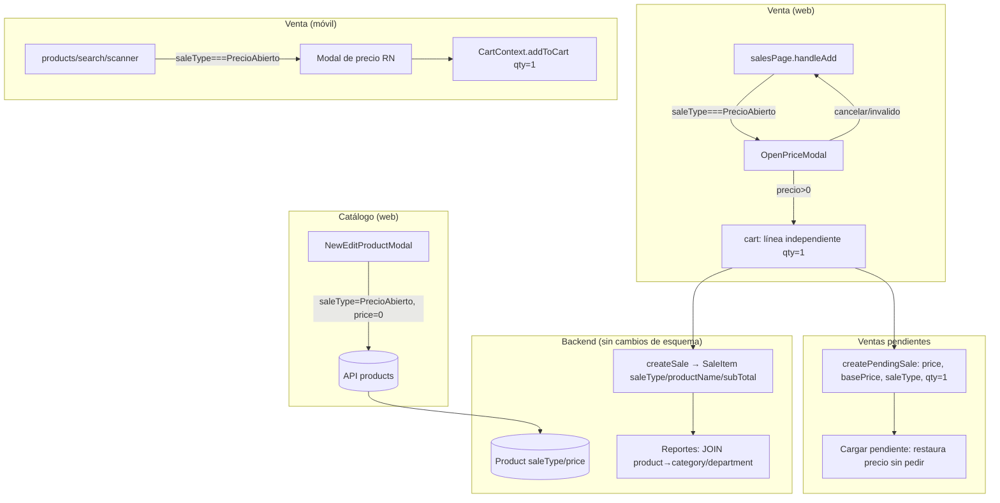
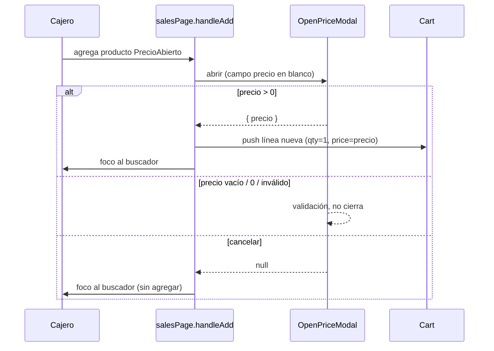

# Diseño Técnico — Productos de Precio Abierto

## Overview

Esta feature introduce el tipo de venta **Precio Abierto** (`saleType = "PrecioAbierto"`): productos
permanentes del catálogo, con nombre, categoría y departamento fijos, cuyo **precio se captura al
momento de la venta** en lugar de estar fijo en el catálogo. El objetivo es reemplazar el uso del
"Producto Común" (código `000000`, anónimo) por productos registrados que sumen correctamente en los
reportes por categoría y departamento.

La feature es predominantemente de **frontend** (POS web y app móvil). El backend **no requiere cambios
de esquema** porque los campos necesarios ya existen y son flexibles:

- `Product.saleType String?` ya admite cualquier valor de texto ("Pieza", "Granel", y ahora "PrecioAbierto").
- `Product.price Float` almacenará `0` como precio base (no sirve para vender, solo compatibilidad).
- `SaleItem.saleType String?` y `SaleItem.basePrice Float?` ya se persisten por línea de venta.
- Los reportes ya hacen JOIN de `SaleItem → product → category` y agrupan por categoría/departamento,
  y agrupan "productos más vendidos" por `productName`. Como los productos de Precio Abierto son
  productos reales con `productId`, categoría y nombre, **aparecen correctamente en los reportes sin
  cambios de backend**.

El trabajo se concentra en tres puntos del flujo:

1. **Alta/edición de producto** (web): nueva opción de tipo "Precio Abierto" con ocultamiento/limpieza
   de secciones incompatibles (precio base, costo, presentaciones, tiered, promoción, inventario).
2. **Venta** (web y móvil): al agregar un producto `PrecioAbierto`, abrir un modal que pide solo el
   precio; la línea entra con cantidad 1, sin controles de cantidad, y cada agregado es una línea
   independiente.
3. **Ventas pendientes**: preservar y restaurar el precio capturado sin volver a pedirlo.

### Decisiones de diseño clave

| Decisión | Rationale |
|----------|-----------|
| No crear migración de BD | `saleType` es `String?` libre; `price=0` es válido. Agregar un enum o columna nueva rompería compatibilidad y es innecesario. |
| Precio base persistido = `0` | El precio no vive en el catálogo. `0` es un centinela claro; la validación de catálogo se relaja solo para este tipo. |
| Reutilizar el patrón de modal de `ProductComunModal`/`GranelModal` (SweetAlert2 en web) | Consistencia de UX y foco de teclado ya resueltos; evita introducir un nuevo paradigma de modal. |
| Líneas independientes por cada agregado | Cada venta de Precio Abierto puede tener distinto precio; fusionar cantidades perdería esa información (Req 4.3). |
| No tocar el Producto Común en esta fase | Req 7: compatibilidad histórica y el reemplazo del botón "Sin código" queda como paso posterior documentado. |

## Architecture



El flujo respeta la separación existente: el catálogo define el producto, la venta captura el precio,
y el backend persiste la línea con su `productId` real para que los reportes funcionen.

### Flujo de captura de precio en venta (web)



## Components and Interfaces

### 1. Catálogo web — `NewEditProductModal.tsx`

Cambios en el formulario de alta/edición:

- **Opción de tipo de venta**: agregar "Precio Abierto" al selector de `saleType` (junto a "Pieza" y "Granel").
- **Derivado de estado**: `const isOpenPrice = saleType === "PrecioAbierto";`
- **Ocultamiento condicional** cuando `isOpenPrice`:
  - Ocultar campos "Precio base" (presentación base / `price`) y "Costo".
  - Mostrar la leyenda: `El precio se definirá al momento de la venta`.
  - Ocultar sección de presentaciones.
  - Ocultar/forzar `pricingMode = "simple"` (no permitir tiered).
  - Ocultar sección de promoción (`isPromo` forzado a `false`).
  - Ocultar/forzar `trackInventory = false`.
- **Limpieza al cambiar a Precio Abierto** (Req 2.5): al setear `saleType = "PrecioAbierto"`, resetear
  `priceTiers=[]`, `pricingMode="simple"`, `isPromo=false`, `promoPrice=0`, `presentations=[base]`,
  `trackInventory=false`, de modo que no se guarden configuraciones contradictorias.
- **Validación** (`validateForm`): cuando `isOpenPrice`
  - Exigir `name` y `category` (como siempre).
  - **No** exigir `price > 0` ni `cost > 0` (relajar las reglas de precio base y costo).
- **Submit** (`handleSubmit`): cuando `isOpenPrice`, construir `productToSave` con
  `price = 0`, `cost = 0`, `pricingMode = "simple"`, `priceTiers = []`, `isPromo = false`,
  `presentations = undefined`, `trackInventory = false`, `saleType = "PrecioAbierto"`.

### 2. Venta web — `salesPage.tsx`

- **Nuevo modal de precio**: `OpenPriceModal(product: Product): Promise<{ precio: number } | null>`
  (archivo nuevo `OpenPriceModal.tsx`, basado en `ProductComunModal`). Pide **solo** el precio:
  - Campo en blanco (sin `0` precargado), con placeholder indicando que ingrese el precio.
  - **No** muestra ni permite editar cantidad.
  - `preConfirm` valida `precio > 0`; si no, muestra validación y no cierra.
  - Cancelar devuelve `null`.
- **Enganche en `handleAdd`**: antes de las ramas de tiered/presentaciones/granel, detectar
  `product.saleType === "PrecioAbierto"` y derivar al nuevo flujo:
  ```ts
  if (product.saleType === "PrecioAbierto") {
    const result = await OpenPriceModal(product);
    if (!result) { setSearch(""); inputRef.current?.focus(); return; }
    setCart((prev) => [...prev, {
      ...product,
      quantity: 1,
      price: result.precio,
      // sin selectedPresentation; línea independiente
    }]);
    playAddProductSound();
    setSearch(""); setProducts([]);
    setTimeout(() => inputRef.current?.focus(), 100);
    return;
  }
  ```
- **Líneas independientes** (Req 4.3): el push **no** busca `existing`; siempre agrega una nueva línea,
  a diferencia de la rama normal que fusiona por `id`/presentación.
- **Controles de cantidad** (Req 4.1): en `handleUpdateQuantity`, la condición actual solo permite
  actualizar si `saleType === "pieza"`. Como `PrecioAbierto` no es `"pieza"`, los `+/−` ya quedan
  inhabilitados; además, en el render del carrito, no mostrar los botones `+/−` para líneas con
  `saleType === "PrecioAbierto"` (mismo tratamiento visual que Granel).
- **Subtotal** (Req 3.7): el cálculo de `total` para una línea sin presentación es `price * quantity`.
  Con `quantity = 1`, el subtotal de la línea es exactamente el precio capturado.
- **Persistencia en venta** (`confirmPayment` → `details.map`): la rama "sin presentación" ya produce
  `subTotal = price * quantity`, `price` como `unitPrice`, `productName = item.name` (nombre real) y
  `productId = item.id` (producto real). Debe propagarse `saleType = "PrecioAbierto"` en el detalle si
  el backend lo acepta (campo `SaleItem.saleType` ya existe).

### 3. Venta móvil — `products.tsx`, `search.tsx`, `scanner.tsx`, `cart.tsx`

- **Normalización de `saleType`**: hoy el móvil normaliza a `'Granel'` o `'Pieza'`. Ampliar a:
  ```ts
  const st = product.saleType?.toLowerCase();
  const normalizedSaleType =
    st === "granel" ? "Granel" : st === "precioabierto" ? "PrecioAbierto" : "Pieza";
  ```
- **Modal de precio (RN)**: reutilizar el patrón del modal granel existente, pero pidiendo **solo**
  precio (sin cantidad). Al confirmar con `precio > 0`:
  ```ts
  addToCart({ productId, productName, quantity: 1, unitPrice: precio, saleType: "PrecioAbierto", basePrice: precio });
  ```
- **`CartContext.addToCart`**: hoy fusiona por `productId + presentationId`. Para `PrecioAbierto` se
  requiere **línea independiente**. Opción de diseño: generar un `presentationId` sintético único por
  agregado (p. ej. un `lineId` con timestamp) para que `findIndex` nunca encuentre coincidencia, o
  añadir una rama que, si `saleType === "PrecioAbierto"`, siempre haga `push` sin fusionar. Se prefiere
  la **rama explícita** por legibilidad.
- **`cart.tsx`**: ampliar la condición `isGranel` para ocultar los controles de cantidad también cuando
  `item.saleType === "PrecioAbierto"`, mostrando la cantidad fija 1 sin `+/−`.
- **Checkout móvil**: ya propaga `saleType` y `basePrice` al crear la venta; no requiere cambio adicional.

### 4. Ventas pendientes — `pendingSales.ts` + flujo de carga

- **Guardar** (Req 5.1): al construir el `PendingSaleDetail`, incluir
  `saleType = "PrecioAbierto"`, `price = precioCapturado`, `basePrice = precioCapturado`,
  `quantity = 1`, `subTotal = precioCapturado`, `productName = nombre real`, `productId` real.
  El tipo `PendingSaleDetail` ya tiene `saleType` y `basePrice`.
- **Cargar** (Req 5.2): al reconstruir el carrito desde una venta pendiente, mapear el detalle a una
  línea de carrito con `saleType = "PrecioAbierto"`, `price = basePrice ?? price`, `quantity = 1`,
  **sin** reabrir el modal de precio. La detección es `detail.saleType === "PrecioAbierto"`.

### 5. Reportes — sin cambios

Verificado en `salesController.js`:

- `getSalesByCategory` agrupa por `detail.product?.category?.name`. Como el producto de Precio Abierto
  tiene categoría real, suma en la categoría correcta (Req 6.1). El departamento se deriva de la
  categoría del producto en `getSalesByDepartment` (mismo JOIN), cubriendo Req 6.2.
- `getTopProducts` agrupa por `productName`. Como la venta guarda el nombre real del producto, aparece
  con su nombre y **no** cae en la normalización `"Producto no registrado"` (Req 6.3).

No se requiere modificar controladores de reportes.

### 6. Sincronización — `productSyncService.mjs`

El servicio ya envía `saleType` como parte del payload del producto. `"PrecioAbierto"` viaja sin cambios.
No requiere modificación.

## Data Models

No hay cambios de esquema Prisma. Se documentan los contratos vigentes y cómo se usan.

### `Product` (sin cambios de esquema)

| Campo | Tipo | Uso para Precio Abierto |
|-------|------|-------------------------|
| `saleType` | `String?` | `"PrecioAbierto"` |
| `price` | `Float` | `0` (centinela; no se usa para vender) |
| `cost` | `Float?` | `0` o `null` |
| `categoryId` / `category` | relación | obligatorio; base de los reportes |
| `pricingMode` | — | `"simple"` (nunca tiered) |
| `isPromo` / `priceTiers` / `presentations` / `inventory` | — | no aplican (ocultos/limpiados) |

### `SaleItem` (sin cambios de esquema)

| Campo | Tipo | Uso para Precio Abierto |
|-------|------|-------------------------|
| `productId` | relación | producto real (clave para reportes) |
| `productName` | `String?` | nombre real del producto |
| `quantity` | `Float` | `1` |
| `price` | `Float` | precio capturado (unitario) |
| `subTotal` | `Float` | `precio × 1` |
| `saleType` | `String?` | `"PrecioAbierto"` |
| `basePrice` | `Float?` | precio capturado |

### `PendingSaleDetail` (sin cambios de esquema)

Mismos campos relevantes: `saleType`, `price`, `basePrice`, `quantity`, `subTotal`, `productName`, `productId`.

### Carrito en memoria

- **Web** (`ItemCart`): se reutiliza `Product + { quantity, price }`. Para Precio Abierto:
  `quantity = 1`, `price = precioCapturado`, sin `selectedPresentation`. Cada agregado es un elemento
  nuevo del arreglo (líneas independientes).
- **Móvil** (`CartItem`): `{ quantity: 1, unitPrice: precio, basePrice: precio, saleType: "PrecioAbierto" }`,
  con línea independiente por agregado.

## Correctness Properties

*Una propiedad es una característica o comportamiento que debe cumplirse en todas las ejecuciones
válidas del sistema: una afirmación formal sobre lo que el software debe hacer. Las propiedades son el
puente entre la especificación legible por humanos y las garantías de corrección verificables por
máquina.*

El alcance de PBT en esta feature es la **lógica pura** que se puede extraer del flujo: construcción del
objeto producto al guardar, validación de catálogo, construcción de la línea de carrito a partir del
precio capturado, invariantes del carrito (cantidad fija, líneas independientes), el round-trip de
ventas pendientes y el nombre persistido para reportes. Los aspectos de render de UI (ocultar campos,
mostrar leyendas, abrir modales, foco) se cubren con pruebas de ejemplo, y la agregación de reportes por
categoría/departamento con pruebas de integración (ver Testing Strategy).

Para que estas propiedades sean testeables, la lógica debe extraerse a funciones puras, por ejemplo:
`buildOpenPriceProduct(formState)`, `validateOpenPriceProduct(product)`,
`buildOpenPriceCartLine(product, precio)`, `tryUpdateQuantity(line, change)`,
`toPendingDetail(line)` / `fromPendingDetail(detail)`, y `buildSaleDetail(item)`.

### Property 1: Guardar Precio Abierto normaliza el producto

*Para cualquier* estado de formulario (con cualquier combinación previa de precio, costo, presentaciones,
tiered, promoción e inventario), construir el producto con tipo "Precio Abierto" debe producir siempre
`price = 0`, `saleType = "PrecioAbierto"`, `pricingMode = "simple"`, `priceTiers = []`, `isPromo = false`,
`presentations = undefined` y `trackInventory = false`.

**Validates: Requirements 1.4, 2.5**

### Property 2: Validación de catálogo para Precio Abierto

*Para cualquier* producto de tipo "Precio Abierto", la validación de guardado debe pasar si y solo si
tiene nombre y categoría no vacíos, independientemente de que `price` y `cost` sean 0 (no se exige que
sean mayores a 0).

**Validates: Requirements 1.5, 1.6**

### Property 3: La captura de precio produce una línea con cantidad 1 y subtotal igual al precio

*Para cualquier* precio capturado mayor a 0, la línea de carrito resultante de agregar un producto de
Precio Abierto debe tener `quantity = 1`, `price = precioCapturado` y subtotal `= precioCapturado × 1 =
precioCapturado`.

**Validates: Requirements 3.4, 3.7**

### Property 4: Precios inválidos son rechazados

*Para cualquier* valor de precio inválido (vacío, no numérico, 0 o negativo), la confirmación del modal
de precio debe ser rechazada y el carrito no debe cambiar.

**Validates: Requirements 3.5**

### Property 5: La cantidad de una línea de Precio Abierto es inmutable en 1

*Para cualquier* línea de carrito de Precio Abierto y *cualquier* intento de cambio de cantidad
(incremento o decremento), la cantidad resultante debe permanecer en 1.

**Validates: Requirements 4.2**

### Property 6: Agregados del mismo producto generan líneas independientes

*Para cualquier* producto de Precio Abierto y *cualquier* secuencia de N agregados con precios
arbitrarios (cada uno mayor a 0), el carrito debe terminar con N líneas independientes, cada una con su
precio capturado respectivo y `quantity = 1`, sin fusionar cantidades.

**Validates: Requirements 4.3**

### Property 7: Round-trip de ventas pendientes

*Para cualquier* línea de carrito de Precio Abierto, serializarla a detalle de venta pendiente y luego
restaurarla a línea de carrito debe producir una línea equivalente: mismo precio capturado,
`quantity = 1` y `saleType = "PrecioAbierto"`, sin requerir recaptura del precio.

**Validates: Requirements 5.1, 5.2**

### Property 8: El nombre persistido para reportes es el nombre real del producto

*Para cualquier* producto de Precio Abierto vendido, el `productName` persistido en el detalle de venta
debe ser igual al nombre real del producto y no debe comenzar con "Producto no registrado".

**Validates: Requirements 6.3**

### Property 9: La rama de Precio Abierto no altera el manejo de los demás tipos (no regresión)

*Para cualquier* línea cuyo `saleType` no sea "PrecioAbierto" (p. ej. "Pieza", "Granel" o el Producto
Común), el resultado del agregado al carrito y del cálculo de subtotal debe ser idéntico al
comportamiento previo a esta feature.

**Validates: Requirements 7.1**

## Error Handling

| Caso | Manejo |
|------|--------|
| Precio vacío / 0 / negativo / NaN en el modal de venta | `preConfirm` muestra validación en el modal y no cierra; el carrito no cambia (Req 3.5). |
| Cancelar el modal de precio | Devuelve `null`; no se agrega la línea y se restaura el foco al buscador (Req 3.6). |
| Guardar producto Precio Abierto sin nombre o sin categoría | `validateForm` marca error en los campos faltantes y no envía (Req 1.5). |
| Estado previo con tiered/promo/presentaciones al cambiar a Precio Abierto | La transición limpia esas secciones antes de construir el objeto a guardar, evitando datos contradictorios (Req 2.5). |
| Carga de venta pendiente con detalle Precio Abierto incompleto (sin `basePrice`) | Fallback a `price`; si ambos faltan o son <= 0, la línea se omite y se informa al cajero (defensivo). |
| Backend que no reconoce `saleType = "PrecioAbierto"` | No aplica: `saleType` es `String?` libre y se persiste tal cual; no hay enum que rechace el valor. |

Los errores de validación son no bloqueantes del flujo general (no lanzan excepción): se comunican por
UI (SweetAlert2 en web, `Alert` en móvil) y mantienen al cajero en el punto de corrección.

## Testing Strategy

### Enfoque dual

- **Pruebas unitarias / de ejemplo**: cubren el comportamiento de UI y flujo concreto —presencia de la
  opción "Precio Abierto", ocultamiento de campos (precio base, costo, presentaciones, tiered, promo,
  inventario), leyenda "El precio se definirá al momento de la venta", apertura del modal con solo el
  campo precio y en blanco, ausencia del campo cantidad, cancelación con restauración de foco, y
  ausencia de controles `+/−` en el carrito. (Criterios 1.1–1.3, 2.1–2.4, 3.1–3.3, 3.6, 4.1).
- **Pruebas de propiedad (PBT)**: cubren la lógica pura universal (Properties 1–9).
- **Pruebas de integración**: cubren la agregación de reportes (Req 6.1, 6.2) con datos conocidos.

### Property-Based Testing

PBT **sí aplica** a la lógica pura extraída (construcción de producto, validación, construcción de línea,
invariantes de carrito, round-trip de pendientes, nombre persistido). No aplica al render de UI ni a la
agregación de reportes (que depende de JOINs de BD).

- **Librería**: usar **fast-check** junto al runner de pruebas del proyecto (Vitest/Jest según
  configuración de cada app). No implementar PBT desde cero.
- **Iteraciones**: mínimo **100** por prueba de propiedad.
- **Trazabilidad**: cada prueba de propiedad se etiqueta con un comentario que referencia la propiedad
  del diseño, con el formato: `Feature: precio-abierto, Property {número}: {texto}`.
- **Implementación**: cada propiedad de corrección se implementa con **una sola** prueba de propiedad.
- **Generadores**: incluir casos borde en los generadores —precios en el límite (0, negativos, muy
  grandes, decimales), cadenas de nombre/categoría vacías y con solo espacios, y estados de formulario
  con todas las secciones incompatibles activas.

### Pruebas de integración (reportes)

- Sembrar ventas de productos Precio Abierto con categoría/departamento conocidos y verificar que
  `getSalesByCategory` y `getSalesByDepartment` suman en la categoría y el departamento correctos
  (1–3 ejemplos cada uno). Verificar que `getTopProducts` lista el nombre real del producto.

### No regresión

- Verificar (Property 9 + ejemplos) que el Producto Común (id 1, código `000000`), "Pieza" y "Granel"
  conservan su comportamiento actual tras introducir la rama de Precio Abierto.
